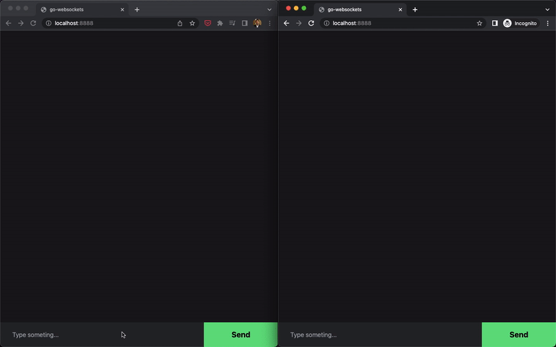
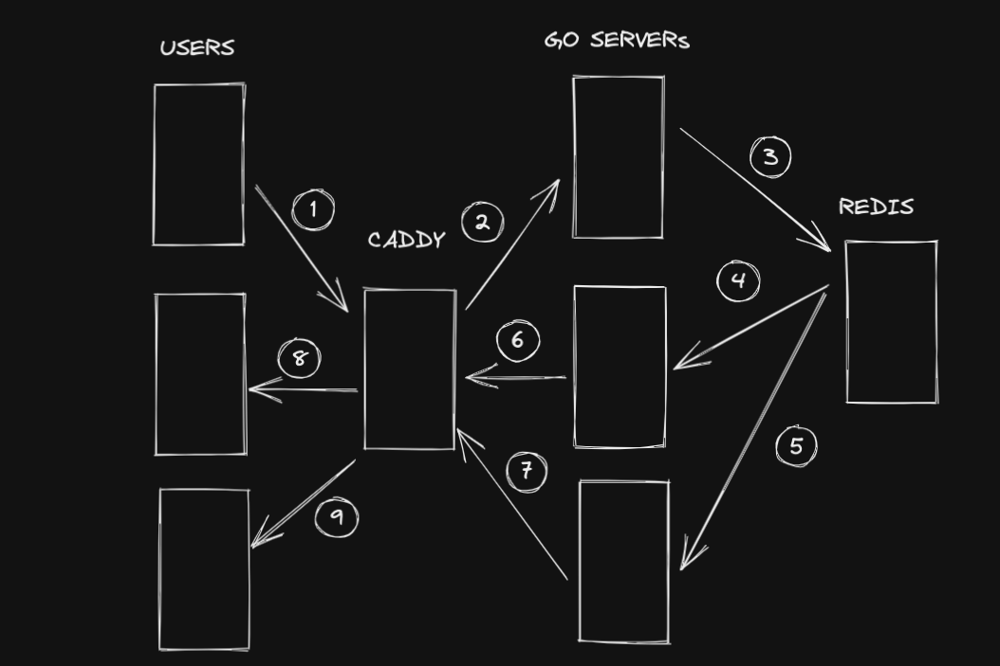

# Golang WebSockets

> Note: The basic part of the repo is in the branch `basic`. The `master` brunch will contain continuous new experiments on the code.

## Basic Websocket Demo



## The current Implementation contains

- single chat server
- random userid for each new user
- notification for adding and leaving users.
- time for sending message.

### Starting to extend the current code base 🚀

- [x] build a UI
- [x] add a `uuid` for each subscriber
- [ ] plan how to implement chat rooms. 💬
- [ ] add a redis adapter to handle multiple server

### Adding Redis

Possible system architechture



#### The blueprint for adding chat rooms. 💬

- user clicks on a chat room
  - sends a POST on `publish` with `user_id` and `room_id`
- user sends a message from a chat room
  - sends a POST on `publish` with `user_id`, `room_id` and `message`.
  - server broadcasts message to only one room.
  - how server will broadcast to only one channel?

## Let's build the damn websocket server. 😤

### References:

- [https://github.com/nhooyr/websocket/blob/master/examples/chat/main.go](https://github.com/nhooyr/websocket/blob/master/examples/chat/main.go)

### Code Explanations

In this part, I will try to explain each part of the code as I write.

First of all, let's look into this part of code

```golang
server := &http.Server{
  // Handler: ,
  ReadTimeout:  time.Second * 10,
  WriteTimeout: time.Second * 10,
}
```

Here we are declaring the server instance with some default settings. We have to provide a `Handler` which will be basically responsible for all the routing and stuff.

Now this `Handler` will be anything as long as it implements the `ServeHTTP` function.(Why??? Glad you asked)
If you go to the documentation for the [`Handler`](https://pkg.go.dev/net/http#Handler) you will find this

```golang
type Handler interface {
	ServeHTTP(ResponseWriter, *Request)
}
```

So the `Handler` interface has the `ServeHTTP` function that you have to implement if you want to use this interface. So for the websocket server, we will create a `WebsocketServer` that implements the `ServeHTTP` function.

Let's go to the `socket.go` file and as usual we will create a struct type for different objects.

We will have a `subscriber` struct with channel of messages and a function to close the connection if the load is too high

```golang
type subscriber struct {
	msgs chan []byte
	closeSlow func()
}
```

and a `SocketServer` struct type

```golang
type SocketServer struct {
	subscriberMessageBuffer int // how many messages a subscriber can have
	publishLimiter          *rate.Limiter // still need to learn what a limiter is.
	logf                    func(f string, v ...interface{}) // Don't know what this means
	serveMux                http.ServeMux // this is basically the router we know
	subscriberMutex         sync.Mutex // this is a mutex to prevent the race conditions
	subscribers             map[*subscriber]struct{} // the list of subscribers.
}
```

Let's create a `newSocketServer` (I think this is equavalent to `new` keyword in OOPs

```golang
func newSocketServer() *SocketServer {
	socketServer := &SocketServer{
		subscriberMessageBuffer: 16,
		publishLimiter:          rate.NewLimiter(rate.Every(time.Millisecond*100), 8),
		logf:                    log.Printf,
		subscribers:             make(map[*subscriber]struct{}),
	}
	socketServer.serveMux.HandleFunc("/", func(w http.ResponseWriter, r *http.Request) {
		w.WriteHeader(http.StatusOK)
		w.Write([]byte("Hello Chat!"))
	})
	return socketServer
}
```

As usual we are defining `socketServer` with the settings and also in the serveMux we are defining the routes.

Now if you set the `Handler` to the socketServer. You will notice this error

```golang
socketServer := newSocketServer()

server := &http.Server{
  Handler:      socketServer,
  ReadTimeout:  time.Second * 10,
  WriteTimeout: time.Second * 10,
}
```

```bash
cannot use socketServer (variable of type *SocketServer) as http.Handler value in struct literal: *SocketServer does not implement http.Handler (missing method ServeHTTP)compilerInvalidIfaceAssign
```

Let's implement the `ServeHTTP`.

```golang
func (_socketServer *socketServer) ServeHTTP(w http.ResponseWriter, r *http.Request) {
	_socketServer.serveMux.ServeHTTP(w, r)
}
```

Now the error is gone. We can run the code again. This time we have to include both files.

`go run main.go socket.go` or `go run *.go`

You can see the server is running and if you curl this time. You can see the message `Hello Chat`!.

Now we have to write two routes. One for subscribing new User (`/subscribe`) and one for publishing messages (`/publish`).

Let's start with `/subscribe` as it will intruduce (finally) the websockets into the field.

A new handler

```golang
func newSocketServer() *socketServer {
  // ...
	// _socketServer.serveMux.HandleFunc("/", func(w http.ResponseWriter, r *http.Request) {
		// w.WriteHeader(http.StatusOK)
		// w.Write([]byte("Hello Chat!"))
	// })
	_socketServer.serveMux.HandleFunc("/subscribe", _socketServer.susbscribeHandler)
	return _socketServer
}
```

Defining the `subscribeHandler`.

```golang
func (ss *socketServer) susbscribeHandler(w http.ResponseWriter, r *http.Request) {
	ws, err := websocket.Accept(w, r, nil)
	if err != nil {
		ss.logf("%v", err)
		return
	}
	defer ws.Close(websocket.StatusInternalError, "Closed in defer")
	err = ss.susbscribe(r.Context(), ws)
	if errors.Is(err, context.Canceled) {
		return
	}
	if err != nil {
		ss.logf("%v", err)
		return
	}
}
```

Which requires `susbcribe`

```golang
func (ss *socketServer) susbscribe(ctx context.Context, ws *websocket.Conn) error {
	ctx = ws.CloseRead(ctx)
	sub := &subscriber{
		msgs: make(chan []byte, ss.subscriberMessageBuffer),
		closeSlow: func() {
			ws.Close(websocket.StatusPolicyViolation, "Server too slow to handle load")
		},
	}
	ss.addSubscriber(sub)
	defer ss.deleteSubscriber(sub)

	for {
		select {
		case msg := <-sub.msgs:
			err := writeTimeout(ctx, time.Second*5, ws, msg)
			if err != nil {
				return err
			}
		case <-ctx.Done():
			return ctx.Err()
		}
	}
}
```

TODO: Write detail explanation for the code.

## Creating a basic web server in golang

It's a repo supposed to be about websockets. But before starting I have to learn how the regular web server works on golang 😕

Let's create a good old web server in golang

Project setup:

```bash
go mod init github.com/fuadnafiz98/go-websockets
```

create a file `main.go`

```bash
touch main.go
# or
# > main.go
```

Start from here:

```golang
package main

func main() {
	//
}
```

Let's start from basic.

`http.ListenAndServe(addr, handler)`

this takes an address and a handler. Handler is like the router.
for now keep the handler to `nil` and give it an address. This function starts the server or returns an error.

We have to check the error and thats it!
we have a running server!

```golang
package main

import (
	"fmt"
	"net/http"
)

func main() {
  fmt.Println("Server running on 0.0.0.0:8888")
	err := http.ListenAndServe("0.0.0.0:8888", nil)
	if err != nil {
		fmt.Println(err)
		return
	}
}
```

Now run the file `go run main.go`

Now curl the server `curl localhost:8888`

which will show `404 page not found`

which is good as we didn't setup any handler!

Now we have to write a handler function.

But before that we can declare the http server in a bit different way which will help us a lot in future.

```golang
package main

import (
	"fmt"
	"net/http"
)

func main() {
	fmt.Println("Server running on 0.0.0.0:8888")

	server := &http.Server{
		Addr: "0.0.0.0:8000",
	}

	err := server.ListenAndServe()
	if err != nil {
		fmt.Println(err)
		return
	}
}
```

This is the same thing as before, we are declaring a `server` instance which is a pointer to a http server. And we are modifiying the Server struct of the http. (I am not sure how to explain this, will modify this later).

Now we can put the address, along with some other configuration of the server.

We can also see there is a function in the `http.Server` struct called `Handler` which is `http.DefaultServerMux` by default but we can implement our own ServerMux.

For implementing that we have to create a new ServerMux `http.NewServeMux()`

```golang
func main() {
	fmt.Println("Server running on 0.0.0.0:8888")

	handler := http.NewServeMux()

	handler.HandleFunc("/", func(w http.ResponseWriter, r *http.Request) {
		w.Write([]byte("HELLO"))
	})

	server := &http.Server{
		Addr:    "0.0.0.0:8000",
		Handler: handler,
	}

	err := server.ListenAndServe()
	if err != nil {
		fmt.Println(err)
		return
	}
}
```

Now in the `HandleFunc` we will declare the pattern `/` and write a `(req, res)` function like in node.js. here it just writes the byte `HELLO`.

Let's create a another path and return some json.

Before returning the json, create a struct type. Struct type is a common way to delare type for a custom data type.

```golang
type Data struct {
	Id       string `json:"id"`
	Username string `json:"username"`
}
```

The properties `struct` will start as uppercase and the optional `json` part is how you want to represent the entitiy when the data is exported in json.

Add this `handlerFunc` before the root handler.

```golang
handler.HandleFunc("/data", func(w http.ResponseWriter, r *http.Request) {
  data := &Data{
    Id:       "98",
    Username: "fuadnafiz98",
  }
  w.WriteHeader(http.StatusOK)
  w.Header().Set("Content-Type", "application/json")
  err := json.NewEncoder(w).Encode(data)
  if err != nil {
    fmt.Println(err)
  }
})
```

With that done, we can make a full CURD application with golang. Before doing that we have to learn how to extract the query parameters from the URL.

That is also pretty easy

```golang
handler.HandleFunc("/books", func(w http.ResponseWriter, r *http.Request) {
  id := r.URL.Query().Get("id")
  w.Write([]byte("id is => " + id))
})
```

### Handling different http methods.

```golang
handler.HandleFunc("/books", func(w http.ResponseWriter, r *http.Request) {
  switch r.Method {
  case http.MethodGet:
    id := r.URL.Query().Get("id")
    w.Write([]byte("id is => " + id))
  case http.MethodPost:
    // perform POST
  case http.MethodPatch:
    // perform PATCH
  case http.MethodDelete:
    // perform DELETE
  default:
    http.Error(w, "Method not allowd", http.StatusMethodNotAllowed)
  }
})
```

So we have all the knowledge we have to build a CURD Application. One more thing missing is some sort of database.
Let's learn **protobuf** and let's see if we can use it some way to store and retirve data.

### Protocol Buffers

#### Resources

- [https://developers.google.com/protocol-buffers/docs/gotutorial](https://developers.google.com/protocol-buffers/docs/gotutorial)
- [https://www.youtube.com/watch?v=\_jQ3i_fyqGA&ab_channel=justforfunc%3AProgramminginGo](https://www.youtube.com/watch?v=_jQ3i_fyqGA&ab_channel=justforfunc%3AProgramminginGo)
-

Install the protoc from [here](https://github.com/protocolbuffers/protobuf/releases)

Create a folder named `book` and inside a file `book.proto`

Writer a simple proto file

```proto
syntax = "proto3";
package main;

option go_package = ".";


message Book {
  int64 id = 1;
  string title = 2;
  string author = 3;
}
```

Compile the proto file

`protoc -I=./book --go_out=./book/ book/book.proto`

This will generate a `book.pb.go` file on the main project folder.

## Resources

- [yet another ws liberary](https://github.com/gobwas/ws)
- [https://sookocheff.com/post/networking/how-do-websockets-work/](https://sookocheff.com/post/networking/how-do-websockets-work/)
- [https://github.com/dafinley/websocket/blob/master/examples/chat/chat.go](https://github.com/dafinley/websocket/blob/master/examples/chat/chat.go)
